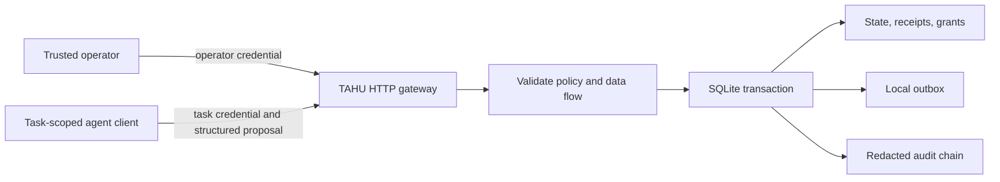

# Architecture

The gateway owns credentials, task policies, artifact labels, audit records and local delivery effects. A model-facing client receives only its task token. Tokens identify task scope server-side; there is no agent-supplied task selector on `/v1/step`.

## Transaction boundary

Each step acquires a SQLite `BEGIN IMMEDIATE` transaction. Stop/expiry/attempt checks precede retries; an exact replay may return a prior receipt without creating another outbox entry. A new action validates its schema, immutable artifact identity, source labels and destination clearance. A matching approval can authorize restricted delivery, but cannot override unknown classification, stop, expiry or budgets.

Outbox insertion, approval consumption, operation counter, exposure update, receipt and audit record commit together. Failure rolls all of them back. Concurrent send attempts cannot both consume a single approval. A stop request linearizes when its transaction commits; an action already committed before that point cannot be undone. There is no external network side effect inside this transaction.

## Data flow

Only the operator creates initial labels. `read` returns the artifact text and adds its labels to task exposure. `derive` inherits the union of explicit source labels and current exposure. `send` checks the union of artifact labels and task exposure. Unknown labels cannot be declassified through approval.

Task separation limits contamination between properly isolated workflows. It cannot erase secrets already in a model's memory. Policy purpose is recorded for traceability, not semantically enforced. Labels must be trustworthy and complete.

## Audit properties

Each event stores its predecessor hash and a hash of the canonical event. Events contain action fingerprints and decisions, not request bodies, approval tokens or source text. This avoids the v0.1 shallow-copy issue.

The chain detects edits while its anchors are trusted. A privileged database writer can rewrite the entire chain or truncate its tail and recompute it. Save signed checkpoints to an independently controlled append-only store for stronger guarantees. The current verification endpoint does not provide that external anchor. Receipts and outbox contain text and require private storage.

## Deployment boundary

The included HTTP server is a loopback development transport, not an internet-facing production server. It has body and socket time limits but no global connection quota, TLS, load shedding or comprehensive rate limiter. Per-task attempt limits bound agent work, not a network denial-of-service attack or total log storage.

Production integration requires separate OS identities or hardened containers/VMs; no agent mount of service state; egress restricted to the gateway; OS resource limits; TLS or mutually authenticated local transport; an authenticated operator UI; and independent audit storage. These controls are deployment requirements, not features this repository silently installs on the user's computer.
